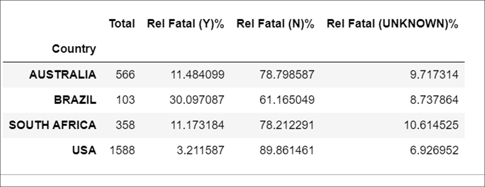
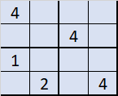

## 
 Hello! I am Yasmin! 👋 
 ##

- 🌳 I am an **environmental engineer**;
- 🥇 Recently I've concluted **Ironhack's Bootcamp in Data Analysis**;
- 🎰 I am currently delving into **data analysis** and **science**;
- 🗒️ This is where I am building my portfolio.

I am an Environmental Engineer, specialist in management of contaminated sites, with background as analyst in an environmental consulting. I mostly deal with subjects in hidrogeology, hidrogeochemestry and recently data analysis. Currently, I am investing in learning advanced SQL and Machine Learning skills.

Feel free to contact me:

 
   
   
   

---

## 
 Github Stats 
 ##

  <a href="https://github.com/yasmin-atique">
  
  

  

---
## 
 Tech Tools 
 ##
  

	
	
	
	
	

 
	

---
## 
 Projects 
 ##
<table>
  
  <tr>
    <td width="50%" valign="top">
      <h4 align="center">Clustering analysis of Amazon deforestation</h4>
         
	

        
	

         
        

I've used IBAMA's data and HDBSCAN method to identify spots of deforestation in Amazon Forest. 

      

        <strong> Technologies used </strong>
         
        
	
	
	
	
	
	
	
	
      

      

        <strong> IDE used </strong>
         
        

      

    
      

    </td>

<td width="50%" valign="top">
      <h4 align="center">Relation between Rain in São Paulo and AM deforestation: tableau project</h4>
         
	

        
	

         
        

	I've webscraping in INMET's Website to build the dataset in python and SQL. The main goal was to analyse the relation between São Paulo State pluviometry, Amazon deforastation and La niña/El niño phenomenon  Repo below:

      

	  
        <strong> Technologies used </strong>
         
        
	
	
	
      

      

        <strong> IDE used </strong>
         
        

      

    
  </tr>
	
  <tr>
    <td width="50%" valign="top">
      <h4 align="center">Shark Attack Project</h4>
         
	

        
	

         
        
The goal of this projecto was to analyse which country has the more fattal cases and which spieces are more deadly

      

        <strong> Technologies used </strong>
         
        
	
	
      

      

        <strong> IDE used </strong>
         
	

      

    
      

    </td>
	  
<td width="50%" valign="top">
      <h4 align="center">Sudoku</h4>
         
	

        
	

         
        
This was my first project in python. The goal was to create a Sudoku game.

 
	

        <strong> Technologies used </strong>
         
        
	
      
  

</td>
  </tr>
</table>

---
## 
 Certificates and certifications 
 ##
 

